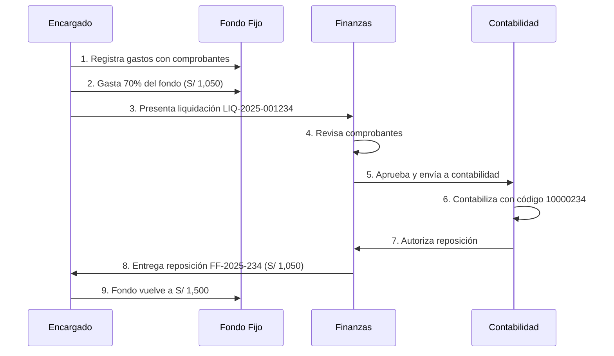

# 📋 Sistema de Control de Caja Chica con Fondo Fijo Empresarial

## 🎯 Descripción General

Sistema completo de gestión de Caja Chica con Fondo Fijo basado en las mejores prácticas financieras y contables empresariales de 2025. Implementa controles rigurosos, trazabilidad completa y cumple con normativas de auditor

ía interna.

## 📊 Arquitectura del Sistema

### Entidades Principales

```
1. FONDO FIJO (PettyCashFund)
   ├── Gastos (PettyCashExpense)
   ├── Liquidaciones (PettyCashSettlement)
   ├── Reposiciones (PettyCashReplenishment)
   ├── Arqueos (PettyCashAudit)
   └── Transferencias Provisionales (PettyCashTransfer)
```

---

## 1. 💰 FONDO FIJO (PettyCashFund)

### Descripción
Fondo asignado a un empleado/encargado que se mantiene **CONSTANTE**. Cuando se gasta, se repone exactamente el monto liquidado para volver al monto original.

### Campos Clave
- `fundCode`: Código único (ej: **FF-2025-001**)
- `assignedAmount`: Monto fijo asignado (ej: S/ 1,500.00)
- `currentBalance`: Saldo disponible actual
- `responsibleName`: Nombre del encargado
- `responsibleId`: DNI/ID del empleado
- `settlementThreshold`: % para liquidar (default: 70%)
- `status`: ACTIVE, SUSPENDED, CLOSED

### Estados del Fondo
- **ACTIVE**: Operativo, se pueden registrar gastos
- **SUSPENDED**: Temporalmente bloqueado (en auditoría, por ejemplo)
- **CLOSED**: Cerrado definitivamente

### Ejemplo
```json
{
  "fundCode": "FF-2025-001",
  "fundName": "Caja Chica - Administración",
  "assignedAmount": 1500.00,
  "currentBalance": 450.00,
  "responsibleName": "Juan Pérez",
  "responsibleId": "12345678",
  "department": "Administración",
  "settlementThreshold": 70
}
```

---

## 2. 💸 GASTOS (PettyCashExpense)

### Descripción
Registro individual de cada gasto realizado del fondo fijo. Debe tener comprobante y justificación.

### Campos Clave
- `expenseCode`: Código único autogenerado
- `amount`: Monto del gasto
- `description`: Descripción del gasto
- `vendor`: Proveedor
- `receiptNumber`: Nº de comprobante
- `receiptType`: BOLETA, FACTURA, RECIBO
- `taxableAmount`: Base imponible
- `taxAmount`: Monto de impuesto (IGV, IVA, etc.)
- `attachmentUrl`: URL de la foto/scan del comprobante
- `justification`: Sustento empresarial del gasto
- `status`: PENDING, APPROVED, REJECTED, SETTLED

### Flujo de Aprobación
1. **PENDING**: Gasto registrado, pendiente de revisión
2. **APPROVED**: Aprobado por supervisor
3. **REJECTED**: Rechazado, no válido
4. **SETTLED**: Incluido en una liquidación

### Ejemplo
```json
{
  "expenseCode": "EXP-2025-00001",
  "expenseDate": "2025-12-27T10:30:00Z",
  "amount": 85.50,
  "description": "Útiles de oficina",
  "vendor": "Librería San Miguel",
  "receiptNumber": "B001-12345",
  "receiptType": "BOLETA",
  "taxableAmount": 72.45,
  "taxAmount": 13.05,
  "attachmentUrl": "https://storage.../recibo.jpg",
  "justification": "Materiales para área de marketing",
  "status": "APPROVED"
}
```

---

## 3. 📝 LIQUIDACIONES (PettyCashSettlement)

### Descripción
Rendición de cuentas del fondo gastado. Se presenta cuando se alcanza el **threshold** (ej: 70% del fondo gastado). Agrupa múltiples gastos.

### Campos Clave
- `settlementCode`: Código único (ej: **LIQ-2025-001234**)
- `settlementDate`: Fecha de presentación
- `totalAmount`: Suma de todos los gastos incluidos
- `expenseCount`: Cantidad de gastos
- `responsibleName`: Quien liquida
- `receivedBy`: Quien recibe en finanzas
- `accountedBy`: Contador que procesa
- `accountingCode`: Código contable (ej: **10000234**)
- `status`: PENDING, APPROVED, REJECTED, ACCOUNTED

### Flujo de Liquidación
1. **PENDING**: Liquidación presentada con comprobantes
2. **APPROVED**: Aprobada por finanzas/gerencia
3. **REJECTED**: Rechazada (faltan documentos, etc.)
4. **ACCOUNTED**: Contabilizada con asiento contable

### Regla de Negocio
Según mejores prácticas 2025:
- Se liquida cuando el gasto alcanza **50-70%** del fondo
- Plazo máximo: **48 horas** desde la recepción
- Todos los comprobantes deben ser **originales y válidos**

### Ejemplo
```json
{
  "settlementCode": "LIQ-2025-001234",
  "settlementDate": "2025-12-27",
  "totalAmount": 1050.00,
  "expenseCount": 15,
  "responsibleName": "Juan Pérez",
  "receivedBy": "María González",
  "accountedBy": "Pedro Ramírez",
  "accountingCode": "10000234",
  "status": "ACCOUNTED"
}
```

---

## 4. 🔄 REPOSICIONES (PettyCashReplenishment)

### Descripción
Reintegro del monto liquidado para restaurar el fondo a su monto original. Se genera con código **FF** + año + secuencia.

### Campos Clave
- `replenishmentCode`: Código único (ej: **FF-2025-234**)
- `amount`: Monto a reponer (= monto de liquidación aprobada)
- `paymentMethod`: CASH, TRANSFER, CHECK
- `referenceNumber`: Nº de transferencia/cheque
- `approvedBy`: Quien autoriza la reposición
- `deliveredBy`: Quien entrega el dinero
- `receivedBy`: Quien recibe (responsable del fondo)
- `status`: PENDING, DELIVERED, CONFIRMED

### Flujo de Reposición
1. **PENDING**: Reposición aprobada, pendiente de entrega
2. **DELIVERED**: Dinero entregado al responsable
3. **CONFIRMED**: Responsable confirma recepción

### Regla de Negocio
- La reposición SIEMPRE iguala el monto de la liquidación
- Devuelve el fondo a su monto original: `assignedAmount`
- Se vincula 1:1 con una liquidación

### Ejemplo
```json
{
  "replenishmentCode": "FF-2025-234",
  "settlementId": "uuid-de-liquidacion",
  "amount": 1050.00,
  "paymentMethod": "TRANSFER",
  "referenceNumber": "TRF-0012345",
  "approvedBy": "Carlos Fernández",
  "deliveredBy": "María González",
  "receivedBy": "Juan Pérez",
  "status": "CONFIRMED"
}
```

---

## 5. 🔍 ARQUEOS (PettyCashAudit)

### Descripción
Verificación **sorpresiva** o programada del efectivo físico vs. registros. Fundamental para prevenir fraudes.

### Campos Clave
- `auditCode`: Código único (ej: **ARQ-2025-001**)
- `auditType`: SCHEDULED, SURPRISE, ANNUAL
- `expectedCash`: Efectivo esperado según registros
- `actualCash`: Efectivo físico contado
- `variance`: Diferencia (actualCash - expectedCash)
- `pendingExpenses`: Gastos con comprobante pero no registrados aún
- `auditedBy`: Nombre del auditor
- `responsiblePresent`: ¿Estuvo presente el responsable?
- `findings`: Hallazgos de la auditoría
- `recommendations`: Recomendaciones
- `attachmentUrl`: Acta de arqueo firmada

### Tipos de Arqueo
- **SURPRISE**: Arqueo sorpresivo (mejor práctica para prevenir fraude)
- **SCHEDULED**: Arqueo programado mensual/trimestral
- **ANNUAL**: Arqueo anual de cierre

### Regla de Negocio (Mejores Prácticas 2025)
- Arqueos sorpresivos **al menos 1 vez al mes**
- El responsable del fondo **NO debe tener acceso** a registros contables
- Diferencias > 1% requieren **investigación inmediata**
- Se realiza **conciliación diaria o semanal** según volumen

### Ejemplo
```json
{
  "auditCode": "ARQ-2025-001",
  "auditDate": "2025-12-27T14:00:00Z",
  "auditType": "SURPRISE",
  "expectedCash": 450.00,
  "actualCash": 448.50,
  "variance": -1.50,
  "pendingExpenses": 50.00,
  "auditedBy": "Ana Torres (Auditoría Interna)",
  "responsiblePresent": true,
  "findings": "Diferencia menor de S/ 1.50. Gastos menores sin comprobante.",
  "recommendations": "Solicitar comprobantes para todos los gastos, sin excepción.",
  "status": "COMPLETED"
}
```

---

## 6. 🔁 TRANSFERENCIAS PROVISIONALES (PettyCashTransfer)

### Descripción
Traspaso temporal del fondo (o parte de él) a otro encargado. Requiere **recibo provisional**.

### Campos Clave
- `transferCode`: Código único (ej: **TRF-2025-001**)
- `fromFundId`: Fondo origen
- `toResponsibleName`: Nombre del nuevo encargado temporal
- `toResponsibleId`: DNI/ID del nuevo encargado
- `amount`: Monto transferido
- `transferType`: PARTIAL, TOTAL, TEMPORARY
- `reason`: Motivo de la transferencia
- `receiptNumber`: Nº de recibo provisional
- `returnDate`: Fecha programada de devolución
- `status`: PENDING, DELIVERED, RETURNED, CANCELLED

### Tipos de Transferencia
- **PARTIAL**: Transferencia de parte del fondo
- **TOTAL**: Transferencia del fondo completo
- **TEMPORARY**: Con fecha de devolución programada

### Regla de Negocio
- Requiere **recibo provisional firmado** por ambas partes
- Debe documentarse el **motivo** (vacaciones, ausencia, etc.)
- Si es TEMPORARY, debe tener `returnDate`
- Al retornar, se registra `returnedAt`

### Ejemplo
```json
{
  "transferCode": "TRF-2025-001",
  "fromFundId": "uuid-del-fondo",
  "toResponsibleName": "Laura Sánchez",
  "toResponsibleId": "87654321",
  "amount": 1500.00,
  "transferType": "TEMPORARY",
  "reason": "Encargado titular de vacaciones del 20/12 al 05/01",
  "receiptNumber": "REC-PROV-001",
  "returnDate": "2025-01-06",
  "status": "DELIVERED"
}
```

---

## 📐 Flujo Operativo Completo



---

## 🔐 Controles y Seguridad

### 1. Segregación de Funciones
- ❌ El responsable del fondo **NO** accede a registros contables
- ✅ Finanzas revisa comprobantes
- ✅ Contabilidad procesa asientos
- ✅ Auditoría realiza arqueos sorpresivos

### 2. Trazabilidad Completa
- Cada transacción tiene código único
- Timestamps de creación y modificación
- Registro de quién aprueba, entrega, recibe
- Adjuntos digitales de todos los comprobantes

### 3. Validaciones Automáticas
- Balance del fondo debe cuadrar siempre
- No se puede gastar más del saldo disponible
- Liquidaciones requieren comprobantes válidos
- Reposición solo si liquidación está ACCOUNTED

### 4. Reportes de Auditoría
- Resumen de gastos por categoría
- Historial de liquidaciones
- Log de arqueos con variaciones
- Transferencias provisionales pendientes de retorno

---

## 📚 Fuentes y Referencias

Este sistema está basado en las siguientes fuentes de mejores prácticas financieras 2025:

1. [SAP Concur - Diferencias entre Caja Chica y Fondo Fijo](https://www.concur.pe/blog/article/cajas-chicas)
2. [Tickelia - Qué es el fondo fijo y cómo gestionarlo](https://tickelia.com/pe/blog/contabilidad-y-regulacion-tributaria/fondo-fijo/)
3. [TEC - Reglamento de Operación de Fondos Fijos](https://www.tec.ac.cr/reglamentos/reglamento-operacion-fondos-fijos-caja-chica)
4. [Instructivo para el Manejo del Fondo Fijo Ecuador](https://www.finanzas.gob.ec/wp-content/uploads/downloads/2016/10/Instructivo-para-el-Manejo-del-Fondo-Fijo-de-Caja-Chica-en-Unidades-Administrativas.pdf)

---

## 🚀 Próximos Pasos de Implementación

1. ✅ Esquema de base de datos creado
2. ⏳ Migración de Prisma (requiere conexión DB)
3. ⏳ APIs REST para cada entidad
4. ⏳ Componentes UI para gestión
5. ⏳ Reportes y dashboards
6. ⏳ Sistema de notificaciones
7. ⏳ Integración con scanner de comprobantes

---

**Desarrollado siguiendo estándares financieros empresariales 2025** 🏢
